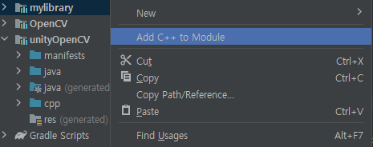

# OpenCV with Unity

OpenCV와 Unity 연동에 대한 Study를 기록하기 위한 레포지토리.

## OpenCV Build

**Resources**

- [OpenCV Download (4.8.1)](https://github.com/opencv/opencv/releases/tag/4.8.1)
- [CMake (3.28.0-win)](https://github.com/Kitware/CMake/releases/tag/v3.28.0-rc4)
- Visual Studio 2022
- Unity 2021.3
- Win10

### CMake setting


1. Where is the source code에 다운받은 OpenCV source code 경로 추가
2. Where to build the binaries에 build한 솔루션이 위치할 경로 추가
3. Configure


4. 화면과 같이 설정 후, Finish
5. 창이 닫히면, Generate
6. 솔루션이 위치할 디렉토리로 가면, visual studio 솔루션 파일이 있는 것을 확인할 수 있음. CMake에서 Open Project하면, 바로 솔루션이 열림.


7. 시작 프로젝트를 CMakeTargets의 **INSTALL**로 변경
8. 현재 x64를 타겟으로 하였으므로, Debug, Release 각각 빌드 후, 커피 타임


9. 빌드가 완료되었으면, 소스 디렉토리의 *include* 폴더, 솔루션 디렉토리의 *bin*, *lib*을 수집하여 **최종 디렉토리**를 구성.
10. 환경 변수 설정
- 새 시스템 변수 추가
    - OPENCV_DIR : 위에서 설정한 최종 디렉토리
- Path 추가
    - %OPENCV_DIR%\bin\Debug
    - %OPENCV_DIR%\bin\Release

## OpenCV Project 기본 설정

1. c++ 프로젝트 생성
2. 프로젝트 속성 설정


3. *모든 구성 설정*
- 플랫폼은 당연하게 x64
- Dll로 구성 형식 변경 (일반)
- 추가 포함 디렉토리 ```$(OPENCV_DIR)\include```추가 (C/C++ -> 일반)
- 추가 라이브러리 디렉토리 ```$(OPENCV_DIR)\lib\Debug```, 그리고 ```$(OPENCV_DIR)\lib\Release``` 추가 (링커 -> 일반)

4. Release
- 추가 종속성에 ```opencv_core480.lib```, ```opencv_highgui480.lib``` 추가 (링커 -> 입력)
- 부모 또는 프로젝트 기본값에서 상속 체크

5. Debug
- 추가 종속성에 ```opencv_core480d.lib```, ```opencv_highgui480d.lib``` 추가 (링커 -> 입력)
- 부모 또는 프로젝트 기본값에서 상속 체크

6. Unity에서 테스트할 코드 작성

```cpp
#include "opencv2/core.hpp"

struct Color32
{
	uchar red;
	uchar green;
	uchar blue;
	uchar alpha;
};

extern "C"
{
	__declspec(dllexport) void FlipImage(Color32 **rawImage, int width, int height)
	{
		using namespace cv;

		Mat image(height, width, CV_8UC4, *rawImage);

		flip(image, image, -1);
	}
}
```

## Unity 테스트


로즈번님이 잘 뒤집어진다.

## Unity with Android

오랜 시간에 걸쳐, 드디어 성공했다. 물론, 기존 작업 환경에서 최대한 작업을 해보려고 노력했으나, **aar**과 **so**파일로 선회.

**Resources**

- [OpenCV Download (android-sdk-4.8.1)](https://github.com/opencv/opencv/releases/tag/4.8.1)
- Android Studio
- Unity 2021.3
- Win10

### Android project setting

1. 새 프로젝트 생성
2. File/New/Import Module을 통해, *OpenCV-android-sdk/sdk*을 타겟하여, Import.
3. File/New/New Module을 통해, *Android Library* 생성.



4. 생성된 라이브러리에 C++ Module 생성.
 - Create CMakeList.txt at the following location 선택
5. 라이브러리/cpp/CMakeLists.txt에 내용 추가

```cmake
find_package(OpenCV REQUIRED)

add_library(...

target_link_libraries( ...
                ${log-lib}
		${OpenCV_LIBS})
```

6. 라이브러리 build.gradle의 cmake에 내용 추가

```gradle
...
    defaultConfig {
        minSdk 24
        targetSdk 33
        ...
        externalNativeBuild {
            cmake {
                arguments "-DOpenCV_DIR=opencv-android-sdk-경로/opencv-4.8.0-android/sdk/native/jni",
                        "-DANDROID_TOOLCHAIN=clang",
                        "-DANDROID_STL=c++_static"
                targets "라이브러리 이름"
            }
        }
    }
...
```

7. 본격적인 cpp 코드 작성.

```cpp
#include <opencv2/opencv.hpp>

extern "C"{

    struct Color32
    {
        uchar red;
        uchar green;
        uchar blue;
        uchar alpha;
    };

    void FlipImage(Color32* rawImage, int width, int height) {
        using namespace cv;
        Mat image(height, width, CV_8UC4, rawImage);
        flip(image, image, -1);
    }
}
```
- Window 코드와 다르게, 1차원으로 ref Texture2D를 받아서 Filp을 진행.
- 2차원으로 통신시, 결과물을 Unity Texture에 SetPixels32()할 시, ArgumentException이 발생
	- Length가 1로 잡히는 것으로 보아, 2차원 배열 전달에 문제가 있어보임.
	- 따라서, Unity에서 1차원으로 변형 -> 라이브러리 통신 -> 1차원 결과물을 다시 2차원으로 복호화를 진행.
    - 원인은 c++, c# 사이의 **배열에 대한 메모리 구조**
        - c#은 실제로 일렬로 늘어선 메모리로 표현됨.
        - c++은 다차원 구조를 유지

8. Plugin 빌드 (Build/Make '프로젝트명.모듈명.main')
9. Unity 설정
- 빌드된 aar과 Opencv shared library 배치
	- Assets/Plugins/Android에 빌드된 aar 배치
	- opencv-android-sdk-경로/opencv-4.8.0-android/sdk/native/libs에 플랫폼 별 so 파일이 있음. 폴더 그대로 Unity에 Import (Unity에서 디렉토리 구조를 파악하여, 플랫폼에 맞게 so 파일을 세팅해줌).
10. Unity 코드 작성

```csharp
using System;
using System.Runtime.InteropServices;
using UnityEngine;
using UnityEngine.UI;

namespace oepncvwithunity
{
    public class SceneManager : MonoBehaviour
    {
        [SerializeField] private Button _imageFlipButton;
        [SerializeField] private Image _targetImage;

#if UNITY_ANDROID && !UNITY_EDITOR
        private const string _dllName = "unityOpenCV";

        [DllImport(_dllName)]
        private static extern void FlipImage(IntPtr target, int width, int height);
#else
        private const string _dllName = "OpenCVwithUnityAndroid";

        [DllImport(_dllName)]
        private static extern void FlipImage(ref Color32[] target, int width, int height);
#endif

        private void Start()
        {
            _imageFlipButton.onClick.AddListener(OnImageFlipButton);
        }


        private void OnImageFlipButton()
        {
            var targetImagePixels = _targetImage.sprite.texture.GetPixels32();
            Debug.Log($"before enter to process : {targetImagePixels.Length}");
#if UNITY_ANDROID && !UNITY_EDITOR
            // 1차원 배열을 IntPtr로 변환하여 전달
            GCHandle handle = GCHandle.Alloc(targetImagePixels, GCHandleType.Pinned);
            IntPtr ptr = handle.AddrOfPinnedObject();

            FlipImage(ptr, _targetImage.sprite.texture.width, _targetImage.sprite.texture.height);

            // 해제
            handle.Free();
#else
            FlipImage(ref targetImagePixels, _targetImage.sprite.texture.width, _targetImage.sprite.texture.height);
#endif
            Debug.Log($"after enter to process : {targetImagePixels.Length}");
            _targetImage.sprite.texture.SetPixels32(targetImagePixels);
            _targetImage.sprite.texture.Apply();
        }
    }
}
```

## Reference
- https://darkstart.tistory.com/38
- https://youtu.be/mrBsn7JDf28?si=tv1jSw-2yRe5OI7N
- https://www.sysnet.pe.kr/2/0/13141?pageno=10
