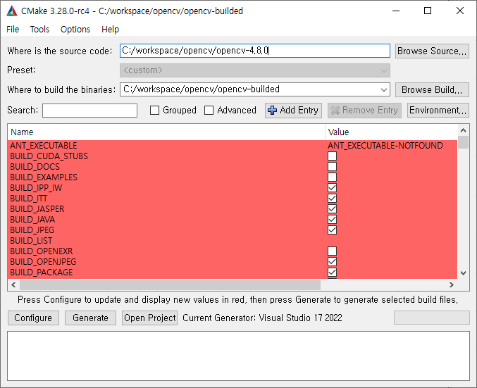
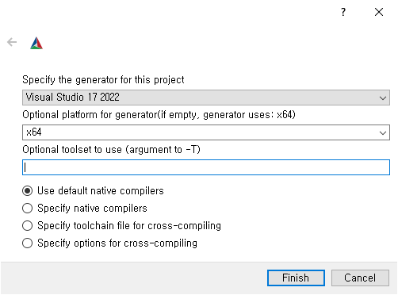
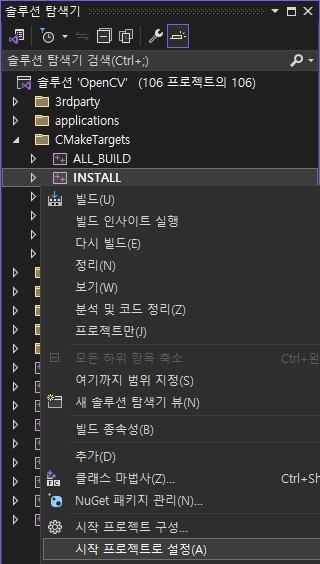
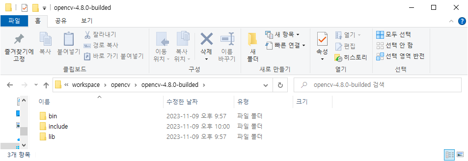
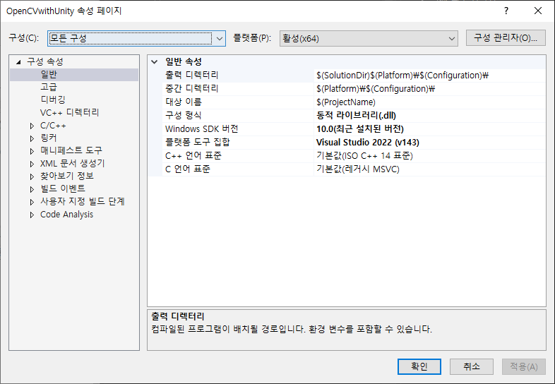
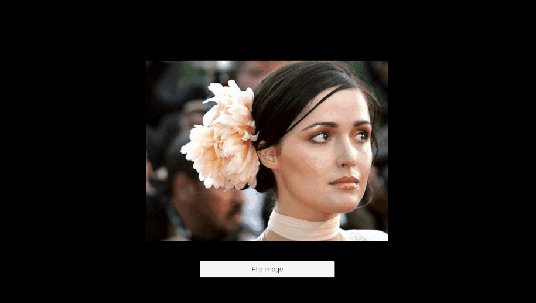

# OpenCV with Unity

OpenCV와 Unity 연동에 대한 Study를 기록하기 위한 레포지토리.

## OpenCV Build

**Resources**

- [OpenCV Download (4.8.1)](https://github.com/opencv/opencv/releases/tag/4.8.1)
- [CMake (3.28.0-win)](https://github.com/Kitware/CMake/releases/tag/v3.28.0-rc4)
- Visual Studio 2022
- Unity 2021.3
- Win10

### CMake setting



1. Where is the source code에 다운받은 OpenCV source code 경로 추가
2. Where to build the binaries에 build한 솔루션이 위치할 경로 추가
3. Configure



4. 화면과 같이 설정 후, Finish
5. 창이 닫히면, Generate
6. 솔루션이 위치할 디렉토리로 가면, visual studio 솔루션 파일이 있는 것을 확인할 수 있음. CMake에서 Open Project하면, 바로 솔루션이 열림.



7. 시작 프로젝트를 CMakeTargets의 **INSTALL**로 변경
8. 현재 x64를 타겟으로 하였으므로, Debug, Release 각각 빌드 후, 커피 타임



9. 빌드가 완료되었으면, 소스 디렉토리의 *include* 폴더, 솔루션 디렉토리의 *bin*, *lib*을 수집하여 **최종 디렉토리**를 구성.
10. 환경 변수 설정
- 새 시스템 변수 추가
    - OPENCV_DIR : 위에서 설정한 최종 디렉토리
- Path 추가
    - %OPENCV_DIR%\bin\Debug
    - %OPENCV_DIR%\bin\Release

## OpenCV Project 기본 설정

1. c++ 프로젝트 생성
2. 프로젝트 속성 설정



3. *모든 구성 설정*
- 플랫폼은 당연하게 x64
- Dll로 구성 형식 변경 (일반)
- 추가 포함 디렉토리 ```$(OPENCV_DIR)\include```추가 (C/C++ -> 일반)
- 추가 라이브러리 디렉토리 ```$(OPENCV_DIR)\lib\Debug```, 그리고 ```$(OPENCV_DIR)\lib\Release``` 추가 (링커 -> 일반)

4. Release
- 추가 종속성에 ```opencv_core480.lib```, ```opencv_highgui480.lib``` 추가 (링커 -> 입력)
- 부모 또는 프로젝트 기본값에서 상속 체크

5. Debug
- 추가 종속성에 ```opencv_core480d.lib```, ```opencv_highgui480d.lib``` 추가 (링커 -> 입력)
- 부모 또는 프로젝트 기본값에서 상속 체크

6. Unity에서 테스트할 코드 작성

```cpp
#include "opencv2/core.hpp"

struct Color32
{
	uchar red;
	uchar green;
	uchar blue;
	uchar alpha;
};

extern "C"
{
	__declspec(dllexport) void FlipImage(Color32 **rawImage, int width, int height)
	{
		using namespace cv;

		Mat image(height, width, CV_8UC4, *rawImage);

		flip(image, image, -1);
	}
}
```

## Unity 테스트



로즈번님이 잘 뒤집어진다.

## Reference
- https://darkstart.tistory.com/38